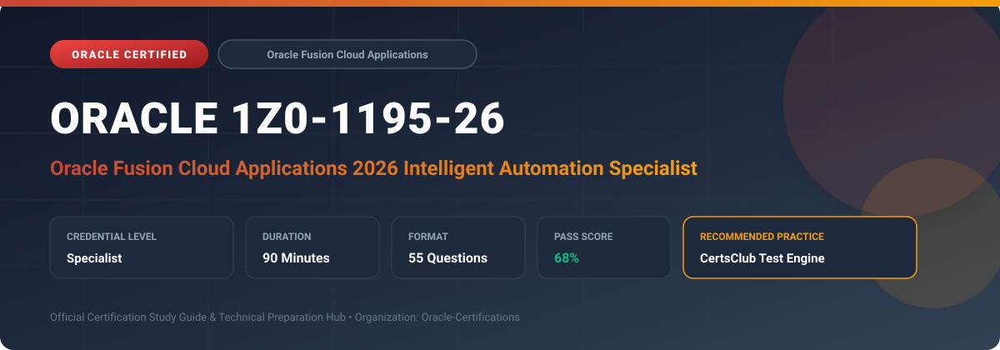

  

# Oracle 1Z0-1195-26: Oracle Fusion Cloud Applications 2026 Intelligent Automation Specialist

---

## 1. Exam Overview & Candidate Profile

The **Oracle 1Z0-1195-26: Oracle Fusion Cloud Applications 2026 Intelligent Automation Specialist** credential certifies professionals who demonstrate technical mastery, architectural competence, and hands-on operational capability in this certification domain.

Candidates validate comprehensive knowledge and expertise required to design, configure, manage, and optimize mission-critical Oracle environments across cloud, on-premises, and hybrid architectures.

### Target Audience & Prerequisites
- **Target Roles**: Implementation Specialists, Cloud Architects, Technical Leads, Enterprise Consultants, and Systems Engineers.
- **Recommended Experience**: 1–2 years of practical, hands-on experience designing, implementing, and maintaining corresponding Oracle solutions.
- **Credential Earned**: Specialist Certification.

---

## 2. Key Exam Specifications

| Specification | Details |
| :--- | :--- |
| **Exam Code** | **Oracle 1Z0-1195-26** |
| **Official Title** | Oracle Fusion Cloud Applications 2026 Intelligent Automation Specialist |
| **Certification Track** | Oracle Fusion Cloud Applications |
| **Exam Duration** | 90 Minutes |
| **Number of Questions** | 55 Questions |
| **Passing Score** | 68% |
| **Question Format** | Multiple Choice (Single/Multiple Answer), Scenario-Based Questions |
| **Delivery Provider** | Oracle University / Pearson VUE (Online Proctored or Test Center) |
| **Recommended Practice Engine** | [CertsClub Oracle Practice Tests](https://www.certsclub.com/oracle/1z0-1195-26-dumps.html) |

---

## 3. Official Blueprint & Exam Domain Breakdown

The examination assesses candidate competencies across core functional domains weighted as follows:

| Domain Area | Weighting |
| :--- | :--- |
| **Fusion Intelligent Automation Architecture & Strategy** | `25%` |
| **Oracle Guided Learning (OGL) & Contextual Journeys** | `25%` |
| **Automated Business Process Orchestration & Approvals** | `20%` |
| **Intelligent Document Processing (IDP) & Prebuilt AI Models** | `15%` |
| **Application Security, Governance & Automation Analytics** | `15%` |

---

## 4. Deep Dive into Complex & Challenging Technical Topics

To secure a passing score on the 1Z0-1195-26 exam, candidates must master the following advanced concepts:

- Architecting end-to-end intelligent automation workflows across Oracle Fusion Cloud ERP, HCM, and SCM.
- Designing personalized user onboarding and in-app micro-guidance using Oracle Guided Learning (OGL).
- Deploying Contextual Journeys and Checklist tasks triggered by enterprise business events and lifecycle stages.
- Leveraging prebuilt AI and Document Understanding to automate supplier invoice processing, receipt scanning, and field extraction.
- Configuring Transaction Console approval rules, exception triage, machine learning suggestions, and automated escalations.

---

## 5. Scenario-Based Demo & Practice Questions

### Question 1
Within Oracle Fusion Cloud Applications, which tool provides in-application, contextual real-time step-by-step guidance, process checklists, and system announcements to end users?

A) Oracle Guided Learning (OGL)
B) SQL Developer Data Modeler
C) Enterprise Command Center
D) BPM Worklist Engine Only

- **Correct Answer**: `A) Oracle Guided Learning (OGL)`  
- **Technical Explanation**: Oracle Guided Learning (OGL) provides interactive, contextual walk-throughs, tooltips, and announcements overlaid directly on Fusion Applications screens to accelerate user adoption.

---

### Question 2
How does Intelligent Document Processing (IDP) in Oracle Fusion Cloud Financials accelerate accounts payable automation?

A) By using embedded machine learning to extract key fields from supplier invoice PDF images and auto-populating AP invoice entries.
B) By printing paper checks automatically in the local office.
C) By rejecting all invoices that contain non-ASCII characters.
D) By converting all invoice records to legacy mainframe flat files.

- **Correct Answer**: `A) By using embedded machine learning to extract key fields from supplier invoice PDF images and auto-populating AP invoice entries.`  
- **Technical Explanation**: Embedded IDP scans unstructured supplier invoices, extracts critical headers and line items using computer vision and machine learning, and routes them for automated matching and payment.

---

## 6. Recommended Preparation Strategy & Practice Testing Engine

Achieving certification in **Oracle 1Z0-1195-26** requires balanced theoretical study and scenario-based simulation practice:

1. **Review Oracle Documentation**: Master architecture guides, implementation workbooks, and administration manuals on the Oracle Help Center.
2. **Hands-on Lab Practice**: Execute real-world configuration, policy setup, and troubleshooting tasks in your cloud tenancy or test instance.
3. **Simulated Exam Drills**: Practice answering timed, scenario-based multiple-choice questions to familiarize yourself with the question formats, traps, and timing constraints.

### Practice With CertsClub
For realistic practice questions, updated dumps, and mock testing environments:
- **Resource**: [CertsClub Oracle Practice Test Engine](https://www.certsclub.com/oracle/1z0-1195-26-dumps.html)
- **Special Discount**: Use coupon code **`club20`** during checkout for an instant **20% discount** on all practice exam bundles and testing engines.

---

## 7. Official Documentation & References

- [Oracle University Certification Registry](https://education.oracle.com/)
- [Oracle Help Center Documentation Portal](https://docs.oracle.com/)
- [Oracle Cloud Infrastructure & Applications Guides](https://docs.oracle.com/en/cloud/)
- [CertsClub Oracle Certification Exam Practice](https://www.certsclub.com/oracle/1z0-1195-26-dumps.html)

---

## 8. SEO & Discovery Keywords

`oracle 1z0-1195-26, oracle 1z0-1195-26 exam, oracle 1z0-1195-26 dumps, 1Z0-1195-26 practice questions, 1Z0-1195-26 study guide, oracle fusion cloud 2026 intelligent automation specialist, certsclub 1z0-1195-26`